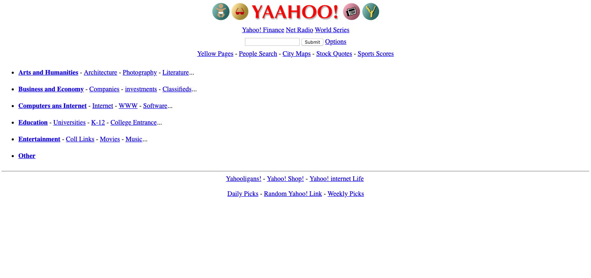

# Yahoo!
> A short revision of brand old Yahoo! home web page.

It shows representation of Yahoo! web site content back in `1996`. Have a fun!

## Usage example

Open `index.html` file in your browser.

## Meta

Volodymyr Yahello – vyahello@gmail.com

[https://twitter.com/vyahello](https://twitter.com/vyahello)

## Contributing

1. Fork it (https://github.com/vyahello/yahoo)
2. Create your feature branch (`git checkout -b feature/fooBar`)
3. Commit your changes (`git commit -am 'Add some fooBar'`)
4. Push to the branch (`git push origin feature/fooBar`)
5. Create a new Pull Request
